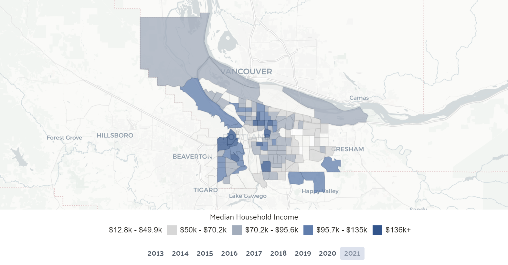

### Introduction

Public transportation is important to increase accessibility in cities and support people without cars. During the pandemic, cities saw a decrease in ridership as in-person spaces closed and people traveled less. Portland's public transportation agency, TriMet, was similarly affected and reduced service or cut routes as a result. The agency has been struggling with low revenue from fares. Starting in January 2024, TriMet will be increasing its fare in response to low ridership. TriMet hasn't increased fares since 2015 and this decision in May 2023 was met with a lot of protest because it disproportionately affects low-income residents. In a survey from TriMet about the fare increase, approximately 43% of the 5,688 respondents said they would take fewer trips. Looking at ridership data, we can analyze how ridership has decreased from 2019 due to the pandemic and see where in the city ridership has rebounded the fastest.

### Data

The data used in this project was collected by TriMet. It contains the ridership by stop across 10 recording periods starting March 2019 to January 2023. The data was initially divided by weekday, Saturday, and Sunday ridership for each stop. I calculated weekly ridership by multiplying weekday ridership by 5 and adding Saturday and Sunday ridership. This is based on instructions I received when obtaining the data. Stops with no ridership in any recording period were removed (529 stops).

### Visualization

The table of mean weekly ridership by recording period shows that ridership was consistent in September 2019 but decreased to a low in April 2020 and has been slowly increasing. Data from January 2023 shows ridership has not returned to pre-pandemic levels.

```{r include=FALSE}

library(readr)
library(gt)
library(tidyverse)
trimetData <- read_csv("TrimetRidershipWernli.csv")
#Weekly ridership is calculated by multiplying weekday ridership by 5
#and adding saturday and sunday
#removes unneeded columns
#returns a df with a stop as an observation
trimetClean<-trimetData%>%
  mutate(weighted_ons=ifelse(SERVICE_KEY=="W",ONS*5,ONS))%>%
  group_by(SUMMARY_BEGIN_DATE,LOCATION_ID)%>%
  summarize(TOTAL_ONS_BY_STOP=sum(weighted_ons))%>%
  pivot_wider(id_cols=LOCATION_ID, names_from = SUMMARY_BEGIN_DATE, values_from =TOTAL_ONS_BY_STOP)%>%
  left_join(trimetData, multiple="first")%>% #to get lat and lon back into df
  select(1:11, LATITUDE, LONGITUDE)
#data set with stop, date as observation
#removes stops with no riders during any period
#-529 stops
trimet1<-trimetClean%>%
  pivot_longer(cols = 2:11,names_to="Date", values_to = "ONS")%>%
  group_by(LOCATION_ID)%>%
  mutate(max=max(ONS,na.rm=TRUE))%>%
  ungroup()%>%
  filter(max>0)
#removing the same 529 stops
#df with 1 stop as an observation
trimet2<-trimet1%>%
  pivot_wider(id_cols=LOCATION_ID, names_from = Date, values_from =ONS)%>%
  left_join(trimetData, multiple="first")%>% #to get lat and lon back into df
  select(1:11, LATITUDE, LONGITUDE)
trimet1%>%
  ggplot(aes(y=ONS, x=Date, color=LOCATION_ID==8347))+
  geom_point()
# 
# trimetTable<-trimet1%>%
#   group_by(Date)%>%
#   summarize(mean=mean(ONS,na.rm=TRUE), sd=sd(ONS,na.rm=TRUE),median=median(ONS,na.rm=TRUE), min=min(ONS,na.rm=TRUE),max=max(ONS,na.rm=TRUE))
# # date reformatting
# trimetTable$Date <- str_remove(trimetTable$Date, " 00:00:00")
# trimetTable$Date <- str_to_lower(trimetTable$Date)%>%str_trim()%>%
#   str_remove_all("-")%>%as.Date("%d%b%y")%>%
#   format.Date("%Y %b")
```

```{r echo=FALSE}
library(tidyr)
#create df for table
trimet3<-trimet2%>%
  mutate(Mar19=`03-MAR-19 00:00:00`)%>%
  top_n(500,Mar19)%>%
  pivot_longer(cols=2:11,names_to = "Date", values_to="ONS")%>%
  mutate(pct_change=(ONS-Mar19)/Mar19)%>%
  group_by(Date)%>%
  summarize(mean=mean(ONS,na.rm=TRUE), sd=sd(ONS,na.rm=TRUE),median=median(ONS,na.rm=TRUE), mean_pct_change=mean(pct_change,na.rm=TRUE))
#format date
trimet3$Date <- str_remove(trimet3$Date, " 00:00:00")
trimet3$Date <- str_to_lower(trimet3$Date)%>%str_trim()%>%
  str_remove_all("-")%>%as.Date("%d%b%y")%>%
  format.Date("%Y %b")
#gt
trimet3%>%
  select(!c(sd))%>%
  arrange(mean)%>%
  gt()%>%
  fmt_number(columns=c(mean,median),decimals=0)%>%
  fmt_number(columns=mean_pct_change,decimals=3)%>%
  tab_spanner(
    label = "weekly ons",
    columns = c(mean,median))%>%
  tab_spanner(
    label = "Mean percent change from Mar 2019",
    columns = c(mean_pct_change))%>%
  cols_width(columns = "Date" ~ px(150))%>%
  cols_align(columns="Date", align="left")%>%
  tab_header(title="Decrease in Trimet Riders from March 2019",subtitle="Top 500 stops from March 2019")%>%
  tab_source_note("Table ordered by mean ridership. Mean_pct_change is calculated by stop as (current ridership - Mar 19 ridership)/Mar 19 ridership.")

```

```{r include=FALSE}


#install.packages("ggmap")
#remove.packages("ggmap")
#install.packages("remotes", INSTALL_opts = " "); 
library(remotes)
remotes::install_github("stadiamaps/ggmap")
library(tidyverse)
library(ggmap)
register_stadiamaps("9260b36a-32f6-419f-a4f2-533fec0d5e06")
```

When looking at the maps, compare them to the incomes by neighborhood in Portland. This gives us an idea of which people rely most on bus services.



The maps show where in Portland ridership changed the most. In April 2020, when ridership was at its lowest, the map is almost entirely green, indicating all over the city ridership was down. Areas around Gresham and Tigard seem slightly less affected. This corresponds to neighborhoods with lower median income and people who were less likely to have work-from-home options.

```{r echo=FALSE, fig.width=10, message=FALSE}
#portland coordinates
portland <- c(left = -123.125, bottom = 45.275, right = -122.25, top = 45.65)
#remove 0s and NA's
trimetMap20<-trimet2%>%drop_na(`05-APR-20 00:00:00`,`03-MAR-19 00:00:00`)%>%
  filter(!(`05-APR-20 00:00:00`==0 | `03-MAR-19 00:00:00`==0))%>%
  mutate(APR_20=`05-APR-20 00:00:00`/`03-MAR-19 00:00:00`)
#map
ggmap(get_stadiamap(portland,maptype="outdoors"))+
  geom_point(trimetMap20,mapping=aes(x=LONGITUDE, y=LATITUDE, color=APR_20), alpha=0.5, size=1.5)+
  scale_color_gradient2(
    low="green",
    mid="orange",
    high='red',
    na.value = "black",
    midpoint = 1, 
    limits = c(0, 2))+
  labs(title="April 2020: Greatest Decrease in Ridership", caption = "Calculated as Apr 2020 ridership divided by Mar 2019 ridership.\n 1 means no change and <1 means ridership decreased. Black dots are values greater than 2.")+
  theme(axis.title=element_blank(),
        axis.text=element_blank(),
        axis.ticks=element_blank())
```

In 2021, we see ridership start to return, with the areas around Gresham and Tigard still with the lowest change in ridership. The areas that remain green (low ridership) are the neighborhoods closer to the Willamette and Downtown Portland.

```{r echo=FALSE, fig.width=10, message=FALSE}
#remove 0s and NAs
trimetMap21<-trimet2%>%drop_na(`05-SEP-21 00:00:00`,`03-MAR-19 00:00:00`)%>%
  filter(!(`05-SEP-21 00:00:00`==0 | `03-MAR-19 00:00:00`==0))%>%
  mutate(SEP_21=`05-SEP-21 00:00:00`/`03-MAR-19 00:00:00`)
#map
ggmap(get_stadiamap(portland,maptype="outdoors"))+
  geom_point(trimetMap21,mapping=aes(x=LONGITUDE, y=LATITUDE, color=SEP_21), alpha=0.5, size=1.5)+
  scale_color_gradient2(
    low="green",
    mid="orange",
    high='red',
    na.value = "black",
    midpoint = 1, 
    limits = c(0, 2))+
  labs(title="Sep 2021 Ridership", caption = "Calculated as Sep 2021 ridership divided by Mar 2019 ridership.\n 1 means no change and <1 means ridership decreased. Black dots are values greater than 2.")+
  theme(axis.title=element_blank(),
        axis.text=element_blank(),
        axis.ticks=element_blank())

```

In January 2023, the overall ridership is still below March 2019 levels. However, near Gresham and Tigard, there is a visible increase in ridership from 2019. The many black dots indicate there were more than double the 2019 riders at those stops.

```{r echo=FALSE, fig.width=10,message=FALSE}
#remove 0s and NAs
trimetMap23<-trimet2%>%drop_na(`22-JAN-23 00:00:00`,`03-MAR-19 00:00:00`)%>%
  filter(!(`22-JAN-23 00:00:00`==0 | `03-MAR-19 00:00:00`==0))%>%
  mutate(JAN_23=`22-JAN-23 00:00:00`/`03-MAR-19 00:00:00`)
#map
ggmap(get_stadiamap(portland,maptype="outdoors"))+
  geom_point(trimetMap23,mapping=aes(x=LONGITUDE, y=LATITUDE, color=JAN_23), alpha=0.5, size=1.5)+
  scale_color_gradient2(
    low="green",
    mid="orange",
    high='red',
    na.value = "black",
    midpoint = 1, 
    limits = c(0, 2))+
  labs(title="Jan 2023 ridership",caption = "Calculated as Jan 2023 ridership divided by Mar 2019 ridership.\n 1 means no change and <1 means ridership decreased. Black dots are values greater than 2.")+
  theme(axis.title=element_blank(),
        axis.text=element_blank(),
        axis.ticks=element_blank())
```

### Conclusion

TriMet ridership has evidently decreased since 2019, however it has recovered unevenly throughout the city. The upcoming fare increase will disproportionately affect lower income riders who cannot afford the new fare. These riders are also more likely not to own a car or come from one of the neighborhoods that saw an increase in ridership. TriMet should consider other funding options before following through on a fare increase. There are sure to be changes in ridership in the following months.

### Sources

-   Ehrlich, April. *TriMet Votes to Increase Single-Use Fares Starting* in 2024, OPB, 24 May 2023, [www.opb.org/article/2023/05/24/trimet-fare-increase/](www.opb.org/article/2023/05/24/trimet-fare-increase/).
